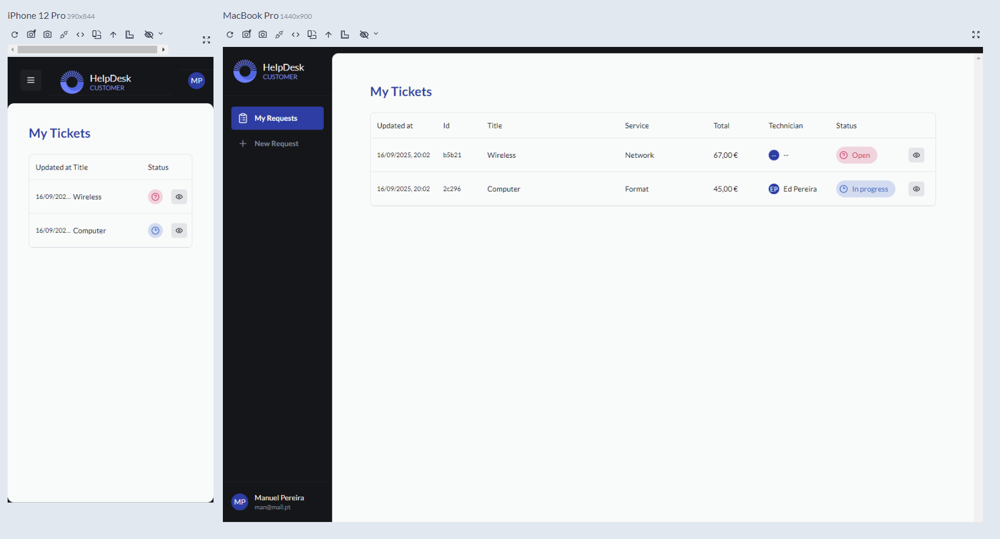
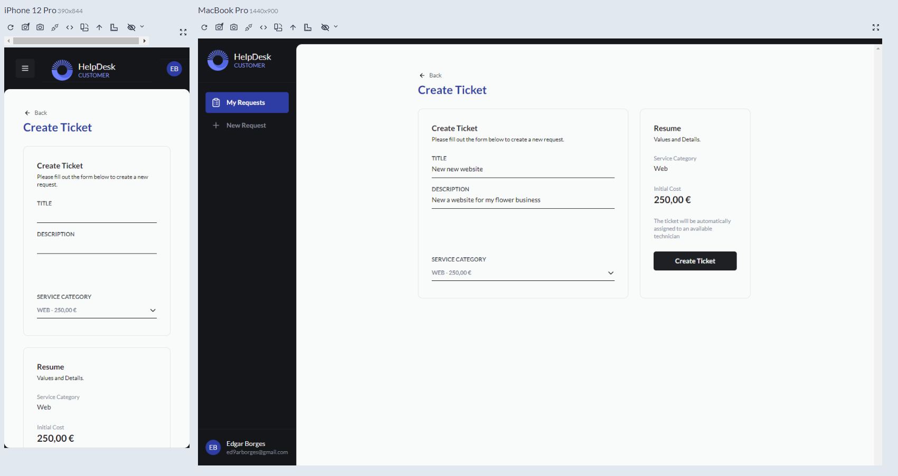
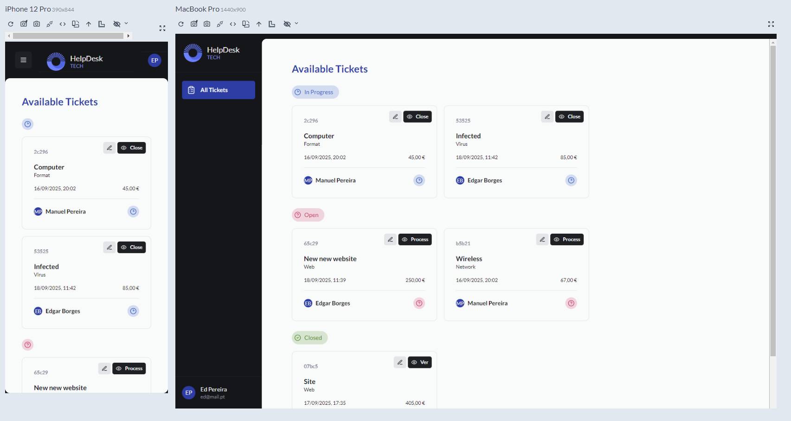

# HelpDesk Web Client


A modern, responsive web client for the HelpDesk ticket management system. Built with React, TypeScript, Vite, and TailwindCSS.

## 📸 Application Preview


*Customer Dashboard view showing active tickets and status overview*


*Ticket creation form with service selection*


*Customer Dashboard view showing active tickets and status overview*


## 🚀 Features

- **User Management**: Login, registration, and profile management with avatar uploads
- **Ticket Management**: Create, view, and track support tickets
- **Service Selection**: Choose from service catalog when creating tickets
- **Role-Based Access**: Different views for customers, technicians, and administrators
- **Responsive Design**: Mobile-friendly interface with TailwindCSS
- **Real-Time Updates**: Status changes and notifications

## 📋 Prerequisites

- Node.js (v18 or higher recommended)
- npm or yarn
- Backend API running (see the [API README](https://github.com/ed9arborges/HELPDESK-API)) Backend service built in Node.js with Express.js, TypeScript, and Prisma

## ⚙️ Installation & Setup

1. **Navigate to the web directory**

   ```bash
   cd web
   ```

2. **Install dependencies**

   ```bash
   npm install
   ```

3. **Set up environment variables**

   Create a `.env` file in the root directory:

   ```env
   VITE_API_URL=http://localhost:3000
   ```

## 🏃‍♂️ Running the Application

### Development Mode

```bash
npm run dev
```

The application will start in development mode and be available at `http://localhost:5173` with hot-reload enabled.

### Production Build

```bash
npm run build
npm run preview
```

The built files will be in the `dist` directory, and you can preview the production build locally.

## 🧪 Testing

Run the test suite:

```bash
# Run all tests
npm test

# Run tests in watch mode
npm run test:watch

# Run tests with coverage report
npm run test:coverage
```

## 📁 Project Structure

```
web/
├── public/                   # Static assets
├── src/
│   ├── assets/               # Images, icons, etc.
│   ├── components/           # Reusable UI components
│   │   ├── ticket/           # Ticket-related components
│   │   ├── user/             # User-related components
│   │   └── ...
│   ├── contexts/             # React contexts for state management
│   ├── core-components/      # Core UI elements and design system
│   ├── dtos/                 # Data transfer objects
│   ├── hooks/                # Custom React hooks
│   ├── layouts/              # Page layout components
│   ├── pages/                # Page components
│   ├── routes/               # Application routes
│   ├── services/             # API service integrations
│   ├── types/                # TypeScript type definitions
│   ├── utils/                # Utility functions
│   ├── App.tsx               # Main App component
│   └── main.tsx              # Application entry point
├── __tests__/                # Test files
└── package.json              # Project dependencies and scripts
```

## 🌐 Browser Compatibility

The application is tested and works in:

- Modern versions of Chrome, Firefox, Safari, and Edge
- Mobile browsers on iOS and Android

## 🛠️ Development Notes

### Key Dependency Features

#### React v19
- Latest features including concurrent rendering and improved hooks
- Better performance with automatic batching of state updates

#### Axios
- Promise-based HTTP client for making API requests
- Interceptors for request/response handling
- Easy request cancellation

#### Zod
- Runtime validation with TypeScript integration
- Used for form validation and API response type checking
- Creates TypeScript types from validation schemas

#### class-variance-authority
- Type-safe component variants
- Integrates with Tailwind for consistent component styling

### Vite Configuration

The project uses Vite for fast development and optimized builds. Configuration is in `vite.config.ts` with plugins for React and SVG support.

### TypeScript

TypeScript is configured for strict type checking. See `tsconfig.json` for configuration details.

### Dependencies

This project uses several key dependencies:

#### Core Dependencies
- **React v19**: Latest version of the React library for building user interfaces
- **React Router v7**: Declarative routing for React applications
- **Axios**: Promise-based HTTP client for API requests
- **Zod v4**: TypeScript-first schema validation library
- **TailwindCSS v4**: Utility-first CSS framework
- **class-variance-authority v0.7**: Library for creating variants of components

#### Development Dependencies
- **Vite v7**: Next-generation front-end tooling for faster development
- **TypeScript v5.8**: Typed JavaScript for better developer experience
- **Jest v29**: JavaScript testing framework
- **React Testing Library v16**: Testing utilities for React components
- **ESLint v9**: Linting tool for identifying problematic code
- **vite-plugin-svgr**: Transform SVGs into React components

### Styling

TailwindCSS is used for styling with the @tailwindcss/vite plugin, providing a utility-first approach to CSS that enables rapid UI development with consistent design tokens.

### Testing

Tests use Jest and React Testing Library. The test environment is set up in `jest.config.ts` and `setupTests.ts`. Jest is configured to work with TypeScript using ts-jest and the jest-environment-jsdom for browser-like testing environment.

#### SVG Handling in Tests

SVG imports with the `?react` query suffix are mocked in tests. See `__mocks__/svgMock.js`.

## 🔄 Continuous Integration

For CI environments:
- Use Node.js v18 or higher
- Ensure environment variables are set correctly
- Run `npm ci` for clean installs

## 📄 License

This project is private and proprietary. All rights reserved.

## 👥 Contributors

- Edgar - Project Creator

---

© 2025 HelpDesk Web Client. All rights reserved.